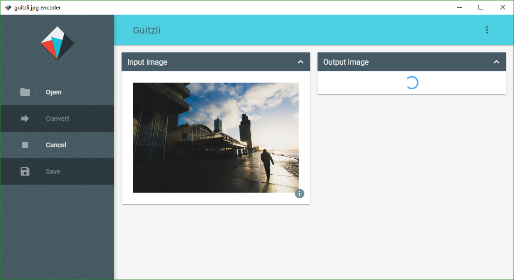

 

# guitzli jpg converter
[](https://github.com/vankesteren/guitzli/releases)
[](https://raw.githubusercontent.com/vankesteren/blog/master/LICENSE)
[](https://github.com/vankesteren/guitzli/commits/master)

Convert image files for web using google's [`guetzli`](https://github.com/google/guetzli) algorithm. This app is built on [`electron`](https://electron.atom.io/) with help from [`electron-forge`](https://beta.electronforge.io/). Also uses [`JQuery`](https://jquery.com/) and [`Bootstrap`](http://getbootstrap.com/) for the user interface.



# How to install
Download the latest version for your system from [Releases](https://github.com/vankesteren/guitzli/releases)

For windows: install directory will be `C:\Users\<username>\AppData\Local\guitzli`. From there you can create a desktop shortcut should you so desire.


# How to build from source

1. Install [Node.js](https://nodejs.org/en/download/) 6.10.2.
2. Install electron-forge: `npm install -g electron-forge`

3. Clone, install, and start.
```bash
git clone https://github.com/vankesteren/guitzli.git
cd guitzli
npm install
npm start
```


# How to package and create binaries

It's simple: `electron-forge make` for your current architecture.
You can also specify another architecture by adding (for example) `--arch=ia32`.
